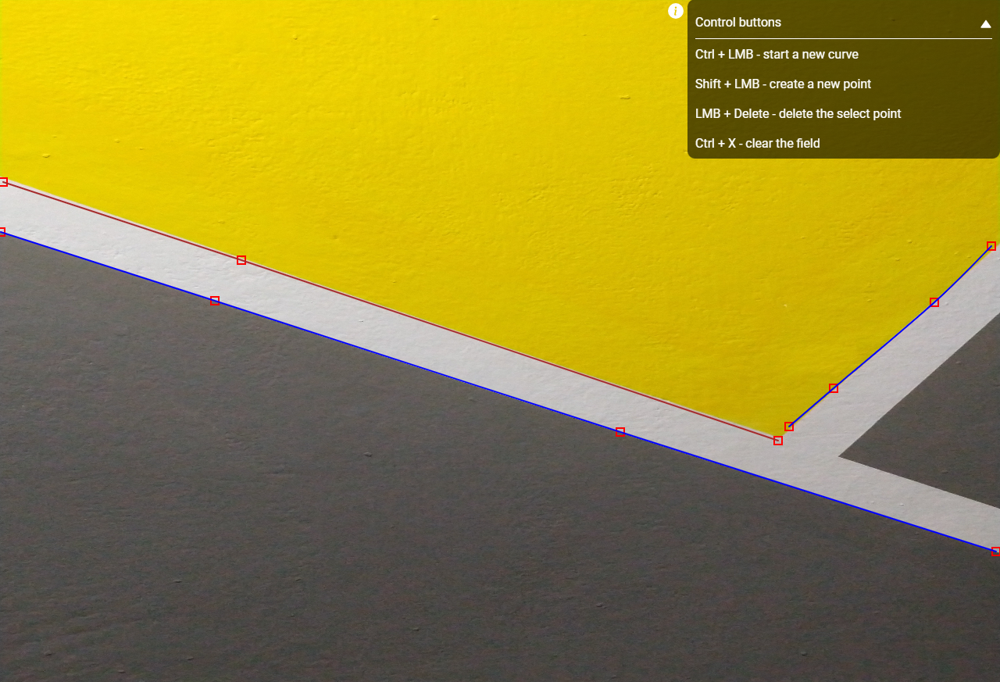

# Bezier curve app

The Bezier Curve app allows users to create and manipulate Bezier curves on a canvas. Users can click and drag to add control points that define the shape of the curve. The app supports multiple curves, and each curve can have multiple control points.

Click [here]() to see the app or [here]() to see how it works in my local machine😃



## Key features of the app:

- The canvas is rendered using the p5.js library within a React component.

- Users can create a new Bezier curve by pressing the Ctrl key.

- Pressing the Shift key while dragging the mouse adds control points to the currently active curve.

- Control points can be selected by clicking on them. Selected points are highlighted in yellow.

- Selected control points can be moved by dragging them with the mouse.

- Pressing the Delete key deletes the selected control point.

- The app provides visual feedback by displaying different colors for active and inactive control points.

- The Bezier curves are rendered on the canvas using the control points.

## Technologies Used
[React](https://react.dev/): A JavaScript library for building user interfaces.
[p5.js](): A JavaScript library for creative coding and visualization.

## To get started, follow these steps:

1. Clone the repository:

```javascript
git clone https://github.com/ksalpern/requestum-bezier-app.git
```

2. Install dependencies.

```javascript
cd bezier-app
yarn
```

3. Start the server.

```javascript
yarn start
```

4. The website is now working on 3000 port, hope you enjoy it 😃

## Usage

1. Press the Ctrl key and click on the canvas to create a new Bezier curve.

2. Press the Shift key and click on the canvas to add control points to the current curve.

3. Click and drag control points to move them around.

4. Press the Delete key to remove a selected control point.

5. Enjoy creating and manipulating Bezier curves!